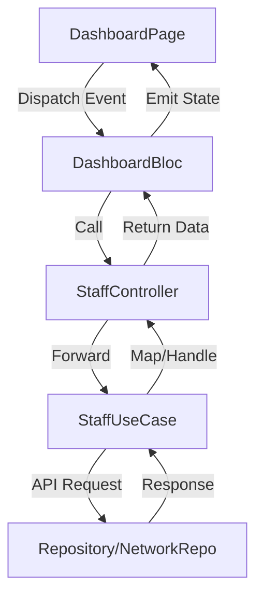

# Dashboard Business Logic and API Documentation

Màn hình Dashboard là trung tâm của ứng dụng Carbon, hiển thị danh sách các đơn hàng vận chuyển (orders) của tài xế dựa trên thời gian và bộ lọc.

## 1. Business Logic

### Khởi tạo View (Initialization)
Khi người dùng mở màn hình Dashboard, `DashboardBloc` sẽ thực hiện các bước sau:
- **Kiểm tra loại người dùng**:
    - Nếu là **Nhân viên nội bộ (Staff - `isInHourse`)**:
        - Gọi API lấy danh sách cửa hàng (Stores).
        - Gọi API lấy danh sách nhân viên (Staffs) thuộc cửa hàng của user.
        - Gọi API lấy danh sách đơn hàng (Orders) theo ngày hiện tại, cửa hàng của user và ID của user.
    - Nếu **không phải Nhân viên nội bộ**:
        - Gọi API lấy danh sách cửa hàng.
        - Gọi API lấy danh sách đơn hàng theo ngày hiện tại và công ty của user.

### Bộ lọc (Filtering)
Dashboard cung cấp các bộ lọc linh hoạt:
- **Chọn Cửa hàng (Select Store)**: Khi thay đổi cửa hàng, ứng dụng sẽ fetch lại danh sách nhân viên và danh sách đơn hàng thuộc cửa hàng đó.
- **Chọn Nhân viên (Select Staff)**: Khi chọn một nhân viên cụ thể, danh sách đơn hàng sẽ được lọc theo nhân viên đó và cửa hàng đang chọn.
- **Chọn Ngày (Date Selector)**: Người dùng có thể chọn ngày giao hàng qua thanh dock hoặc lịch (calendar). Danh sách đơn hàng sẽ được fetch lại theo ngày đã chọn.

### Xử lý Ngoại tuyến (Offline Handling)
Khi người dùng nhấn vào một đơn hàng để xem chi tiết:
- **Nếu có kết nối mạng**: Điều hướng đến trang chi tiết đơn hàng bình thường.
- **Nếu không có kết nối mạng**: 
    - Chuyển sang chế độ Offline.
    - Lưu thông tin đơn hàng tạm thời vào `AppState`.
    - Điều hướng đến trang tạo giao hàng qua mã QR (`deliveryCreationQrCode`) để người dùng có thể tiếp tục làm việc offline.

---

## 2. Các API Endpoints liên quan

### 1. Lấy danh sách Đơn hàng (Fetch Orders)
- **Endpoint**: `GET /driver/orders`
- **Controller Method**: `StaffController.fetchOrders`
- **Tham số chính (Query Parameters)**:
    - `refueling_date`: Ngày cấp nhiên liệu (định dạng `yyyy-MM-dd`).
    - `shipping_company_id`: ID công ty vận chuyển.
    - `shipping_driver_id`: ID tài xế.
    - `tenant_store_id`: ID cửa hàng của tenant.
    - `page` & `page_size`: Phân trang.

### 2. Lấy danh sách Cửa hàng (Fetch Stores)
- **Endpoint**: `GET /tenant/{tenantId}/stores/dropdown`
- **Controller Method**: `StaffController.fetchStores`
- **Tham số chính**:
    - `tenantId`: ID của tenant (lấy từ constant ứng dụng).

### 3. Lấy danh sách Nhân viên (Fetch Staffs)
- **Endpoint**: `GET /account/staff/dropdown`
- **Controller Method**: `StaffController.fetchStaffs`
- **Tham số chính (Query Parameters)**:
    - `tenant_store_id__eq`: ID cửa hàng để lọc nhân viên.

---

## Luồng dữ liệu (Data Flow)

