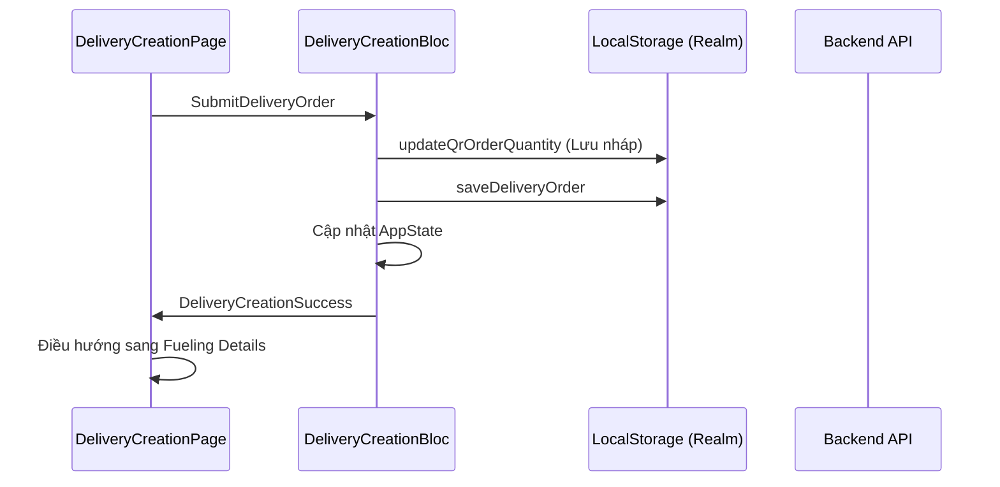

# Tài liệu Logic & API: Delivery Creation

Tài liệu này chi tiết các thành phần kỹ thuật, API và cấu trúc dữ liệu cho tính năng tạo phiếu giao hàng.

## 1. API Endpoints

Các API được gọi thông qua `DeliveryCreationController`:

| Chức năng | Phương thức | Endpoint Path | Ghi chú |
| :--- | :--- | :--- | :--- |
| **Lấy máy móc đơn hàng** | `GET` | `/driver/orders/{order_id}/machines` | Lấy danh sách máy đã được gán cho đơn hàng. |
| **Lấy sản phẩm đơn hàng** | `GET` | `/driver/orders/{order_id}/lines/{order_line_id}/products` | Lấy danh sách sản phẩm thuộc line đơn hàng. |
| **Lấy Master máy móc** | `GET` | `/machines` | Danh sách máy móc toàn hệ thống (dùng để chọn). |
| **Gửi đơn hàng giao** | `POST` | `/driver/orders` | Gửi dữ liệu `DeliveryOrder` hoàn chỉnh lên server. |
| **Cập nhật File biên nhận**| `PUT` | `/driver/orders/{order_id}/receipts/{receipt_id}/update-file` | Đính kèm file PDF/Ảnh biên nhận. |
| **Cập nhật Chữ ký** | `PUT` | `/driver/orders/{order_id}/receipts/{receipt_id}/update-signature`| Gửi ID chữ ký đã upload. |

## 2. Cấu trúc Dữ liệu (Models)

### `DeliveryOrder`
Đây là Model chính chứa toàn bộ thông tin phiếu giao hàng:
- `construction_machines`: Danh sách các máy được cấp dầu (`ConstructionMachine`).
- `receipt_lines`: Danh sách sản phẩm khác (`ReceiptLine`).
- `order_id`, `orderLineId`, `constructionSiteId`, v.v.

### `MachineryItem` (UI/State Model)
Dùng để quản lý trạng thái máy móc trên màn hình:
- `machineryName`, `vehicleNumber`, `quantity`.
- `images`: Danh sách ID ảnh đã upload.
- `productId`: ID sản phẩm dầu gán cho máy này.

## 3. Quản lý Trạng thái (BLoC Logic)

`DeliveryCreationQrCodeBloc` quản lý các sự kiện:

*   `InitDeliveryCreation`: Tải dữ liệu ban đầu từ API và Realm.
*   `AddMachinery`: Thêm một máy mới vào danh sách hiện tại.
*   `UpdateQuantity`: Cập nhật số lượng cho một máy cụ thể.
*   `SubmitDeliveryOrder`: 
    1. Lọc các máy có số lượng > 0.
    2. Cập nhật dữ liệu vào Realm.
    3. Cập nhật `AppBloc` state toàn cục.
    4. Chuyển hướng sang màn hình `fuelingDetailQrcode`.

## 4. Quy trình Gửi dữ liệu (Submission Flow)

> [!NOTE]
> Việc gọi API `postOrder` thực tế có thể được thực hiện ngay tại đây hoặc ở bước xác nhận cuối cùng sau khi lấy chữ ký, tùy thuộc vào cấu hình luồng đồng bộ.
