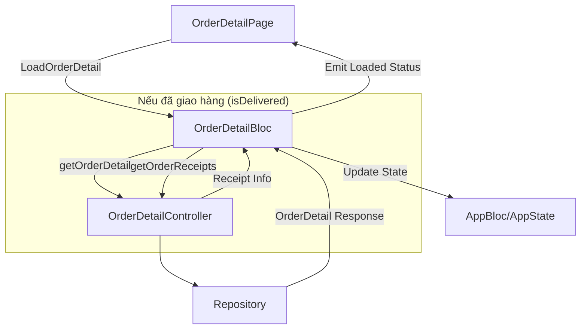

# Order Detail Business Logic and API Documentation

Tài liệu này chi tiết logic nghiệp vụ và các API endpoints được sử dụng trong màn hình Chi tiết đơn hàng (Order Detail).

## 1. Logic Nghiệp vụ (Business Logic)

### A. Kiểm tra quyền thực hiện (Delivery Button Check)
Một trong những logic quan trọng nhất là việc cho phép hoặc chặn tài xế xử lý đơn hàng:

- **Logic**: Nút "Bắt đầu cấp dầu" hoặc các thao tác xử lý sẽ bị vô hiệu hóa (`disabled`) nếu:
    - Đơn hàng đã có `shipping_driver_id` gán cho một người khác.
    - Không có thông tin người dùng đang đăng nhập.
- **Quy tắc**:
    - Nếu `shipping_driver_id == null`: Cho phép bất kỳ ai xử lý (Tài xế tự nhận đơn).
    - Nếu `shipping_driver_id == loggedInUserId`: Cho phép người được chỉ định xử lý.
    - Nếu `shipping_driver_id != loggedInUserId`: Vô hiệu hóa nút xử lý.

### B. Luồng Tải Dữ liệu (`LoadOrderDetail`)
Khi màn hình được mở:
1. **Lấy chi tiết đơn hàng**: Gọi API `getOrderDetail` để lấy thông tin đầy đủ về khách hàng, hiện trường và các mặt hàng (`order_lines`).
2. **Cập nhật App State**: Dữ liệu từ API được chuyển đổi sang model `DeliveryOrder` và lưu vào `AppBloc` để các bước sau (như quét mã QR hoặc nhập khối lượng) có thể sử dụng.
3. **Xử lý đơn hàng đã giao (`isDelivered`)**:
    - Nếu đơn hàng đã hoàn thành, ứng dụng gọi thêm API `getOrderReceipts`.
    - API này cung cấp thông tin về chữ ký, ảnh biên bản và chi tiết thực tế đã cấp cho từng máy móc.

---

## 2. Chi tiết API Endpoints

### 1. Lấy chi tiết Đơn hàng
- **Endpoint**: `GET /driver/orders/{orderId}/order-lines`
- **Controller Method**: `OrderDetailController.getOrderDetail`
- **Tham số Path**: `orderId`
- **Tham số Query**: `order_line_id`

**Mô hình dữ liệu trả về (`OrderDetail`)**:
```json
{
  "id": "string",
  "company_name": "string",
  "construction_site_name": "string",
  "refueling_date": "yyyy-MM-dd",
  "refueling_from_time": "HH:mm",
  "refueling_to_time": "HH:mm",
  "shipping_driver_id": "string",
  "delivery_status": "string",
  "order_lines": [
    {
      "id": "string",
      "product_name": "string",
      "quantity": 100,
      "product_unit": "L"
    }
  ]
}
```

### 2. Cập nhật trạng thái Đơn hàng
- **Endpoint**: `PATCH /driver/orders/{orderId}/status`
- **Controller Method**: `OrderDetailController.updateOrderStatus`
- **Body**:
```json
{
  "delivery_status": "string" // Ví dụ: "DELIVERING", "COMPLETED"
}
```

### 3. Lấy thông tin Biên nhận (Receipts)
- **Endpoint**: `GET /driver/orders/{orderId}/receipts`
- **Controller Method**: `OrderDetailController.getOrderReceipts`
- **Mô tả**: Sử dụng khi đơn hàng đã hoàn thành để xem lại thông tin chữ ký và dầu đã cấp thực tế.

---

## 3. Sơ đồ Luồng dữ liệu (Data Flow)


