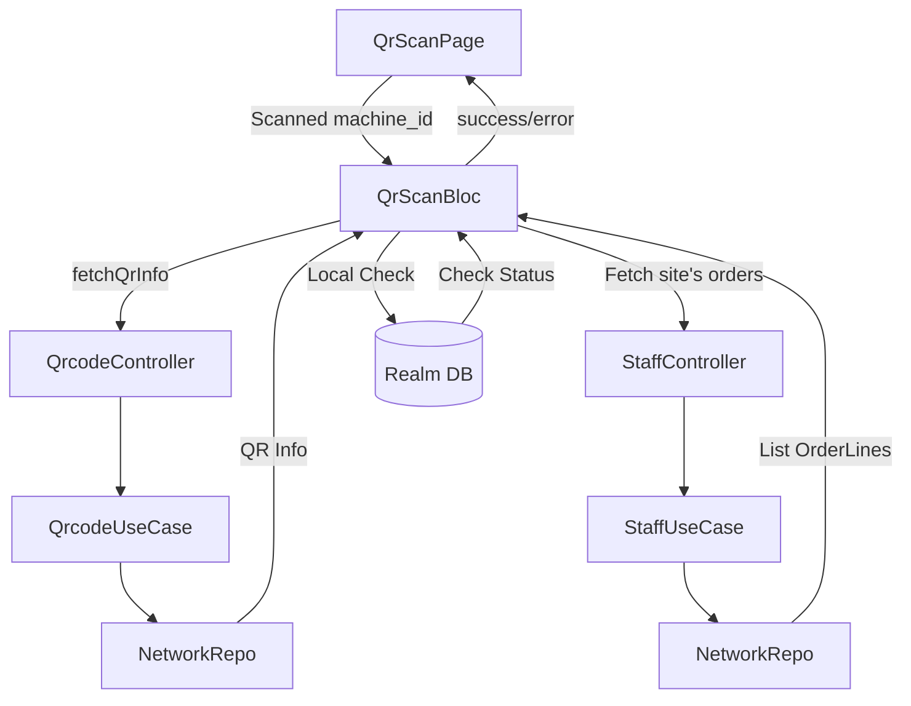

# QR Scan Business Logic and API Documentation

Tài liệu này chi tiết logic nghiệp vụ và các API endpoints được sử dụng trong tính năng quét mã QR để cấp nhiên liệu.

## 1. Logic Nghiệp vụ (Execution Logic)

### Luồng xử lý trong `QrScanBloc`
Khi người dùng thực hiện quét mã QR, sự kiện `FetchOrderLinesRequested` được kích hoạt và thực hiện các bước sau:

1. **Lấy thông tin Máy móc (`fetchQrInfo`)**:
   - Gọi API với `machine_id` lấy từ QR code.
   - Nhận về thông tin `construction_site_id` và chi tiết máy.
2. **Lấy danh sách Đơn hàng (`fetchDriverOrderLines`)**:
   - Sử dụng `construction_site_id` từ bước 1.
   - Lấy `shipping_driver_id` từ thông tin user đang đăng nhập.
   - Lọc theo ngày hiện tại (`refueling_date`) và trạng thái `order_status: ['NEW']`.
3. **Kiểm tra trạng thái Hoàn thành (Local Check)**:
   - Truy vấn Realm database (`getMarchineOfflineById`) để xem máy này đã được cấp nhiên liệu trong ngày chưa.
   - Nếu đã tồn tại bản ghi trong ngày, hiển thị thông báo cảnh báo.
4. **Cập nhật State**:
   - Nếu có đơn hàng, chuyển trạng thái sang `success` và lưu danh sách `orderLines`.
   - Nếu không có đơn hàng, chuyển trạng thái sang `error`.

---

## 2. Chi tiết API Endpoints

### 1. Lấy thông tin Máy móc qua QR
- **Endpoint**: `GET /driver/construction-site/machines/{machine_id}`
- **Controller**: `QrcodeController.fetchQrInfo`
- **Tham số Path**:
    - `machine_id`: ID của máy móc (chuỗi).

**Response Model (`QrInfo`)**:
```json
{
  "id": "string",
  "machine_name": "string",
  "machine_number": "string",
  "construction_site_id": "string",
  "construction_site_name": "string",
  "company_id": "string",
  "company_name": "string",
  "product_name": "string",
  "branch_id": "string",
  "branch_name": "string"
}
```

### 2. Lấy danh sách Đơn hàng theo máy (`fetchDriverOrderLines`)
- **Endpoint**: `GET /driver/order-lines`
- **Controller Method**: `StaffController.fetchDriverOrderLines`
- **Mô tả**: Lấy danh sách các dòng đơn hàng rỗng (chưa cấp phát) của một tài xế tại một hiện trường cụ thể trong một ngày nhất định.

#### Tham số Query (Query Parameters)
| Tham số | Kiểu dữ liệu | Bắt buộc | Mặc định | Mô tả |
| :--- | :--- | :---: | :--- | :--- |
| `construction_site_id` | `String` | **Có** | - | ID của hiện trường xây dựng. |
| `shipping_driver_id` | `String` | **Có** | - | ID của tài xế thực hiện. |
| `refueling_date` | `String` | Không | - | Ngày cấp dầu (định dạng `yyyy-MM-dd`). |
| `order_status[]` | `List<String>` | Không | - | Lọc theo trạng thái đơn hàng (ví dụ: `NEW`). |
| `page` | `int` | Không | `1` | Số trang cần lấy. |
| `page_size` | `int` | Không | `10` | Số lượng mục trên mỗi trang. |
| `sort_columns[]` | `List<String>` | Không | - | Danh sách các cột cần sắp xếp. |
| `sort_orders[]` | `List<String>` | Không | - | Thứ tự sắp xếp tương ứng (`ASC`/`DESC`). |

#### Cấu trúc dữ liệu Response
**Response Object**: `BasePagingResponse<DriverOrderLine>`

**DriverOrderLine Model**:
```json
{
  "id": "string",
  "order_id": "string",
  "order_no": 123,
  "product_id": "string",
  "product_name": "string",
  "quantity": "string"
}
```

---

## 3. Sơ đồ Luồng dữ liệu (Data Flow)


